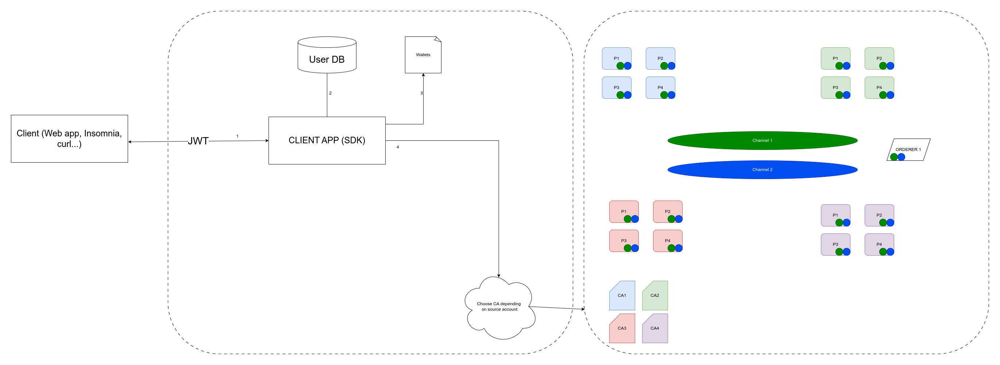

# Hyperledger Fabric Bank 

This repository contains the source code for our Hyperledger Bank project. The project aims to implement a blockchain-based banking system using Hyperledger Fabric.

## Project Overview

The Hyperledger Bank project leverages Hyperledger Fabric to create a decentralized banking system. It allows users to perform various banking operations securely using blockchain technology.

## Architecture

The architecture consists of several components:

1. **Hyperledger Fabric Network**: The core infrastructure built using Hyperledger Fabric, which includes 4 CAs, 4 organizations and 4 peer nodes per organization (every peer is commiting and endorsing peer), orderer node, and two channels.
2. **Smart Contracts (Chaincode)**: Business logic written and tested in golang chaincode to define the banking operations and rules.
3. **Client Application**: HTTP web server that exposes API endpoints for banking operations, which uses golang Hyperledger Fabric SDK for communication with Hyperledger network.

## Getting Started

To get started with the Hyperledger Bank project, follow these steps:

### Starting the Ledger

1. Clone this repository to your local machine.
2. Navigate to the `infrastructure` directory.
3. Execute `run.sh` script (it will take approximately 12 minutes to setup completely)

### Starting the Client App

1. Navigate to the `app` directory.
2. Export environment variables stated in .env file
3. Run the app with command `go run .`

## Endpoints

Here are the endpoints available for interacting with the Hyperledger Bank system:

- **POST /login/:username**: Login (test admin usernames start with s, and common user usernames with u, e.g. s1, u5)
- **POST /create-bank-account/channel1**: Create bank account for user
- **POST /transfer-money/channel1**: Transfer money from account A to account B with possible currency conversion using average exchange rate
- **POST /money-deposit/channel1**: Deposit money into an account.
- **POST /money-withdrawal/channel1**: Withdraw money from an account.
- **POST /add-user/channel1**: Create new user account
- **GET /search/channel1/:by/:param1/:param2**: Queries user accounts based on various parameters
- **GET /search-accounts/channel1/:bank-id/:currency/:balance-thresh**: Search for accounts based on specified criteria.
- **GET /max-account/channel1/:bank-id/:currency**: Retrieves the maximum account balance per currency in chosen bank.

All endpoints with example POST bodies can be also imported into [Insomnia](https://insomnia.rest/) from `app/app_insomnia_endpoints.yaml`
